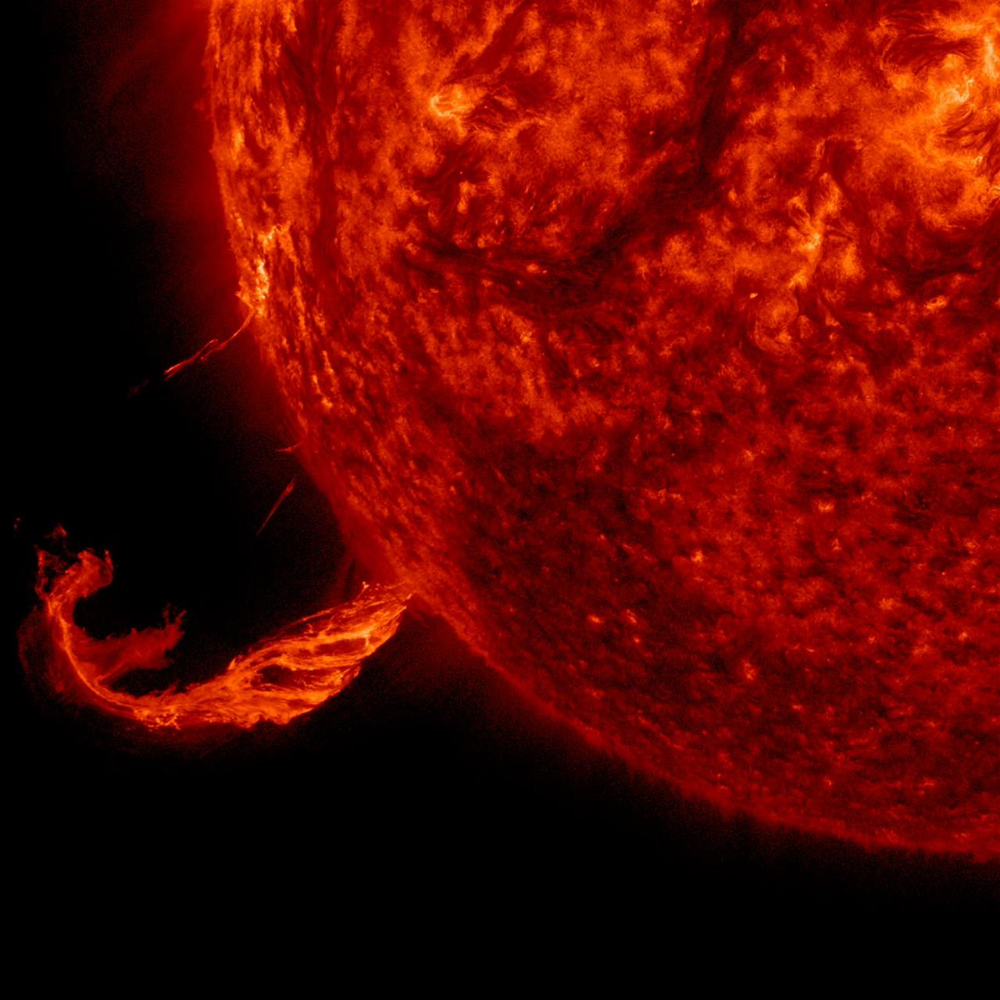

# Solar Flare Events (GOES X-ray)


<div align="center">
  
  <p><em>Credit: NASA/SDO</em></p>
</div>


*Part of a [dataset collection](https://huggingface.co/collections/juliensimon/space-weather-datasets-69c24cae98f1666f2101ca70) on Hugging Face.*

## Dataset description

Individual solar flare detections from GOES X-ray sensors (2017-present) with class, peak flux, and timing. Updated daily.

Solar flares are sudden bursts of electromagnetic radiation from the Sun. They are classified by peak X-ray flux in the 1-8 Angstrom band: B (< 10^-6 W/m2), C (10^-6), M (10^-5), and X (10^-4 W/m2). M and X-class flares can cause radio blackouts, GPS errors, satellite anomalies, and geomagnetic storms that increase atmospheric drag on LEO satellites.

Solar flares originate in magnetically complex active regions where stressed field lines reconnect explosively, converting stored magnetic energy into thermal radiation, accelerated particles, and bulk plasma motion in a matter of minutes. The GOES X-Ray Sensor (XRS) measures the Sun-integrated soft X-ray flux in two broadband channels (0.5-4 A and 1-8 A), with the 1-8 A band used for the standard classification system. The classification is logarithmic: an X1.0 flare has 10 times the peak flux of an M1.0 flare. Within each letter class, the numeric suffix scales linearly.

The timing profile of a flare -- start, peak, and end -- encodes physically meaningful information. The impulsive phase (start to peak) typically lasts 5-20 minutes and corresponds to the primary energy release via magnetic reconnection. The gradual phase (peak to end) can extend for hours as post-flare loops cool. Short-duration impulsive flares tend to be confined events, while long-duration events (LDEs) are more often associated with coronal mass ejections and solar energetic particle events.

This dataset is suitable for **tabular classification, time-series forecasting** tasks.

## Schema

| Column | Type | Description | Sample | Null % |
|--------|------|-------------|--------|--------|
| `satellite` | string | GOES satellite that recorded the event: 'GOES-16' (primary since 2017) or 'GOES-18' (primary from 2022) | GOES-16 | 0.0% |
| `start_time` | datetime64[us] | UTC time when GOES X-ray flux first rises above background threshold; marks onset of the impulsive phase | 2017-02-09 00:41:00 | 0.0% |
| `peak_time` | datetime64[us] | UTC time of maximum X-ray flux in the 1-8 A band; the reference instant used to assign the flare class | 2017-02-09 00:50:00 | 0.2% |
| `peak_flux_wm2` | float64 | Peak GOES X-ray flux in the 1-8 A band in W/m2; ranges from ~10^-8 (quiet sun) to ~10^-3 (extreme X-class); the numeric value that defines the full goes_class | 3.711662941441318e-07 | 0.2% |
| `goes_class` | string | Full NOAA flare classification (e.g. 'B3.7', 'C1.6', 'M5.1', 'X1.0'); letter sets the decade, number is the multiplier (M5.2 = 5.2 x 10^-5 W/m2) | B3.7 | 0.2% |
| `end_time` | datetime64[us] | UTC time when X-ray flux returns to pre-flare background; duration from start to end is typically minutes for impulsive events, hours for long-duration events (LDEs) associated with CMEs | 2017-02-09 00:56:00 | 13.3% |
| `goes_class_letter` | string | NOAA flare class letter: 'A' (background, 10^-8 W/m2), 'B' (10^-7), 'C' (10^-6, minor), 'M' (10^-5, moderate, may cause radio blackouts at HF), 'X' (>= 10^-4, major, can cause HF blackouts, radiation storms, CMEs) | B | 0.2% |

## Quick stats

- **16,113** flare events (2017-02-09 to 2026-06-10)
- **9,614** C-class, **1,609** M-class, **82** X-class flares
- Strongest flare: **X14.6** on 2017-09-06 12:02

## Usage

```python
from datasets import load_dataset

ds = load_dataset("juliensimon/solar-flare-events", split="train")
df = ds.to_pandas()
```

```python
from datasets import load_dataset

ds = load_dataset("juliensimon/solar-flare-events", split="train")
df = ds.to_pandas()

# M and X class flares only
major = df[df["goes_class_letter"].isin(["M", "X"])]

# Flare frequency over time
import matplotlib.pyplot as plt

df["month"] = df["start_time"].dt.to_period("M")
monthly = df.groupby("month").size()
monthly.plot(figsize=(12, 4), title="Monthly Flare Count")
plt.ylabel("Flares")
plt.tight_layout()
plt.show()

# Flare duration distribution
df["duration_min"] = (df["end_time"] - df["start_time"]).dt.total_seconds() / 60
df["duration_min"].hist(bins=50)
plt.xlabel("Duration (minutes)")
plt.title("Flare Duration Distribution")
plt.show()
```

## Data source

https://data.ngdc.noaa.gov/platforms/solar-space-observing-satellites/goes/goes16/l2/data/xrsf-l2-flsum_science/

## Update schedule

Daily at 12:00 UTC

## Related datasets

- [juliensimon/space-weather-indices](https://huggingface.co/datasets/juliensimon/space-weather-indices)

- [juliensimon/donki-space-weather-events](https://huggingface.co/datasets/juliensimon/donki-space-weather-events)

- [juliensimon/solar-wind](https://huggingface.co/datasets/juliensimon/solar-wind)

> If you find this dataset useful, please consider [giving it a like](https://huggingface.co/datasets/juliensimon/solar-flare-events) on Hugging Face. It helps others discover it.

## About the author

Created by [Julien Simon](https://julien.org) — AI Operating Partner at Fortino Capital. Part of the [Space Datasets](https://julien.org/datasets) collection.

## Citation

```bibtex
@dataset{solar_flare_events,
  title = {Solar Flare Events (GOES X-ray)},
  author = {juliensimon},
  year = {2026},
  url = {https://huggingface.co/datasets/juliensimon/solar-flare-events},
  publisher = {Hugging Face}
}
```

## License

[CC-BY-4.0](https://creativecommons.org/licenses/by/4.0/)
