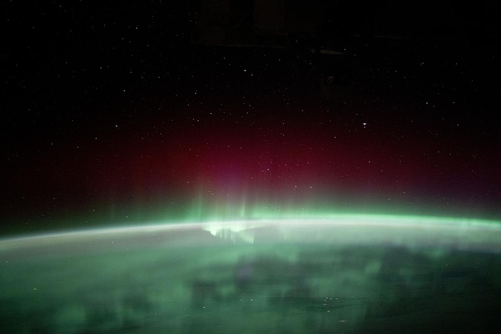

# Real-Time Solar Wind (DSCOVR/ACE)


<div align="center">
  
  <p><em>Credit: NASA</em></p>
</div>


*Part of a [dataset collection](https://huggingface.co/collections/juliensimon/space-weather-datasets-69c24cae98f1666f2101ca70) on Hugging Face.*

## Dataset description

Real-time solar wind plasma and magnetic field measurements from the DSCOVR and ACE spacecraft at the L1 Lagrange point, via NOAA SWPC. Updated daily.

The solar wind is a continuous stream of charged particles flowing from the Sun. Its speed, density, and magnetic field orientation (especially Bz) are the primary drivers of geomagnetic storms. When Bz turns strongly southward (negative), it couples with Earth's magnetosphere and can trigger storms that affect satellites, power grids, and GPS.

This dataset is the missing link in the Sun-to-Earth causal chain: solar flare -> CME -> solar wind -> Dst/Kp storm -> orbital drag.

The measurements come from the DSCOVR (Deep Space Climate Observatory) and ACE (Advanced Composition Explorer) spacecraft orbiting the Sun-Earth L1 Lagrange point, approximately 1.5 million km upstream of Earth. At this vantage point, the instruments sample the solar wind roughly 15-60 minutes before it reaches the magnetopause, providing a critical lead time for geomagnetic storm prediction. DSCOVR's Faraday Cup measures the bulk plasma properties (proton density, speed, and temperature), while its fluxgate magnetometer measures the interplanetary magnetic field (IMF) vector in Geocentric Solar Magnetospheric (GSM) coordinates.

The Bz component of the IMF in GSM coordinates is the single most important parameter for geomagnetic coupling. When Bz is strongly southward (negative), the IMF opposes Earth's northward magnetic field at the dayside magnetopause, enabling magnetic reconnection that transfers solar wind energy into the magnetosphere. Sustained Bz below -10 nT typically produces moderate geomagnetic storms (Kp 6-7, Dst below -100 nT), while extreme events with Bz below -30 nT can trigger severe storms affecting power grids and satellite operations.

Typical quiet-time solar wind conditions show speeds of 300-450 km/s and densities of 3-10 protons/cm^3. Coronal hole high-speed streams elevate speeds to 600-800 km/s, while interplanetary CMEs can drive transient speeds above 1,000 km/s with enhanced magnetic fields.

This dataset is suitable for **time-series forecasting, tabular regression** tasks.

## Schema

| Column | Type | Description | Sample | Null % |
|--------|------|-------------|--------|--------|
| `time_tag` | datetime64[ns] | Measurement timestamp from DSCOVR/ACE at the L1 Lagrange point (UTC, ~1-minute cadence) | 2026-03-17 08:31:00 | 0.0% |
| `density` | float64 | Solar wind proton number density in protons/cm3; typical quiet-time range 3-10 p/cm3; high density combined with high speed increases dynamic pressure, compressing the magnetosphere | 0.38 | 2.8% |
| `speed` | float64 | Solar wind bulk velocity in km/s; typical 350-800 km/s; coronal hole streams reach 600-800 km/s; CME-driven shocks can exceed 1500 km/s | 467.8 | 3.2% |
| `temperature` | float64 | Solar wind proton temperature in Kelvin; typical ~10^5 K; abnormally low values (~10^4 K) suggest passage of a magnetic cloud | 57895.0 | 3.7% |
| `bt` | float64 | Total IMF magnitude in nT — sqrt(Bx^2 + By^2 + Bz^2); typical 2-10 nT; elevated during CME passage | 4.49 | 1.9% |
| `bx_gsm` | float64 | IMF Bx component in Geocentric Solar Magnetospheric (GSM) coordinates in nT; typical range +/-20 nT; sun-Earth direction component | -3.47 | 1.9% |
| `by_gsm` | float64 | IMF By component in GSM coordinates in nT; typical range +/-20 nT; controls asymmetric magnetospheric convection and field-aligned currents | 2.74 | 1.9% |
| `bz_gsm` | float64 | IMF Bz component in GSM coordinates in nT — the primary geomagnetic storm driver; sustained southward (negative) Bz enables dayside magnetic reconnection; < -10 nT drives moderate storms, < -30 nT drives severe storms; typical range +/-20 nT | -0.79 | 1.9% |

## Quick stats

- **127,932** readings (2026-03-17 to 2026-06-15)
- Average speed: **453 km/s**, max: **1233 km/s**
- Minimum Bz: **-27.9 nT** (62,650 southward readings)

## Usage

```python
from datasets import load_dataset

ds = load_dataset("juliensimon/solar-wind", split="train")
df = ds.to_pandas()
```

```python
from datasets import load_dataset

ds = load_dataset("juliensimon/solar-wind", split="train")
df = ds.to_pandas()

# Solar wind speed time series
import matplotlib.pyplot as plt

fig, (ax1, ax2) = plt.subplots(2, 1, figsize=(12, 6), sharex=True)
ax1.plot(df["time_tag"], df["speed"], linewidth=0.5)
ax1.set_ylabel("Speed (km/s)")
ax1.set_title("Solar Wind Speed")

ax2.plot(df["time_tag"], df["bz_gsm"], linewidth=0.5, color="red")
ax2.axhline(0, color="gray", linestyle="--", alpha=0.5)
ax2.set_ylabel("Bz GSM (nT)")
ax2.set_title("IMF Bz (southward = storm driver)")
plt.tight_layout()
plt.show()

# Bz southward events (storm drivers)
southward = df[df["bz_gsm"] < -5]
print(f"{len(southward)} readings with Bz < -5 nT")
```

## Data source

https://www.swpc.noaa.gov/products/real-time-solar-wind

## Update schedule

Daily at 15:00 UTC

## Related datasets

- [juliensimon/dst-index](https://huggingface.co/datasets/juliensimon/dst-index)

- [juliensimon/donki-space-weather-events](https://huggingface.co/datasets/juliensimon/donki-space-weather-events)

- [juliensimon/solar-flare-events](https://huggingface.co/datasets/juliensimon/solar-flare-events)

- [juliensimon/space-weather-indices](https://huggingface.co/datasets/juliensimon/space-weather-indices)

- [juliensimon/parker-solar-probe](https://huggingface.co/datasets/juliensimon/parker-solar-probe)

- [juliensimon/solar-orbiter](https://huggingface.co/datasets/juliensimon/solar-orbiter)

- [juliensimon/cdaw-cme](https://huggingface.co/datasets/juliensimon/cdaw-cme)

- [juliensimon/feng-icmes](https://huggingface.co/datasets/juliensimon/feng-icmes)

> If you find this dataset useful, please consider [giving it a like](https://huggingface.co/datasets/juliensimon/solar-wind) on Hugging Face. It helps others discover it.

## About the author

Created by [Julien Simon](https://julien.org) — AI Operating Partner at Fortino Capital. Part of the [Space Datasets](https://julien.org/datasets) collection.

## Citation

```bibtex
@dataset{solar_wind,
  title = {Real-Time Solar Wind (DSCOVR/ACE)},
  author = {juliensimon},
  year = {2026},
  url = {https://huggingface.co/datasets/juliensimon/solar-wind},
  publisher = {Hugging Face}
}
```

## License

[CC-BY-4.0](https://creativecommons.org/licenses/by/4.0/)
